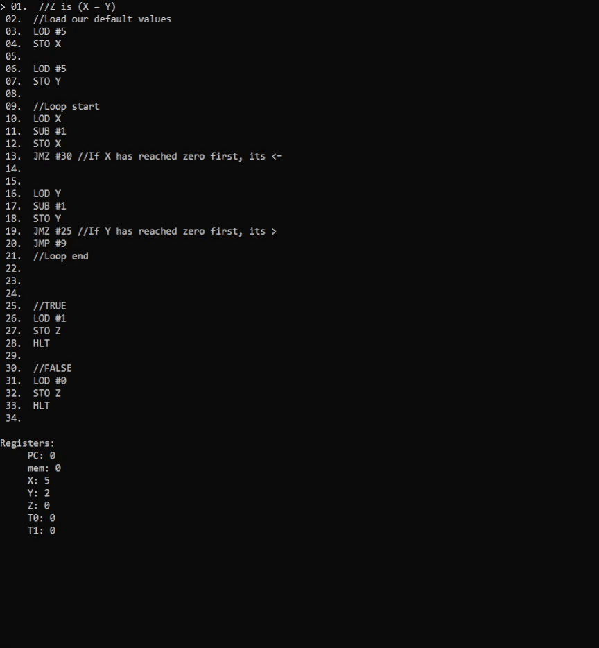

## A basic John Von Neumann machine 

I was reading up on Neumann recently and was very, very impressed by his thoughts. I figured I'd whip up an emulator of his concept for a computing machine in like 1945!!! Just crazy smart, his concepts on self replication were also way ahead of their time. I'll have to implement his statemachine at some point as well.

This runs purely in the windows terminal, to use it, just download the zip, unzip it and drag your program file onto the exe to run it. It'll probably yell about a virus, feel free to compile this yourself or check the code, cuz theres no virus. Hold enter to execute the program one instruction at a time.

| Instruction | Data | Description |
|:--|:--|:--|
|LOD| R \| # | Loads the value into the ALU's memory |
|STO| R | Stores the value into the register |
|ADD| R \| # | Adds the value to the memory value in the ALU |
|SUB| R \| # | Subtracts the memory value in the ALU by the value |
|MUL| R \| # | Multiplies the memory value in the ALU by the value  |
|DIV| R \| # | Divides the memory value in the ALU by the value |
|JMP| R \| # | Jumps the program counter to the value as an index |
|JMZ| R \| # | Jumps if the memory in the ALU equals 0 |
|HLT|  | Halts the program |

> R is register, # is number, R\|# is either

Based off the instruction set of: https://www.vnmsim.app/en-us



### Example for calculating if X is greater than Y, and putting the result in Z:

```
//Z is (X = Y)
//Load our default values
LOD #5
STO X

LOD #5
STO Y

//Loop start
LOD X
SUB #1
STO X
JMZ #30 //If X has reached zero first, its <=


LOD Y
SUB #1
STO Y
JMZ #25 //If Y has reached zero first, its > 
JMP #9
//Loop end


//TRUE
LOD #1
STO Z
HLT

//FALSE
LOD #0
STO Z
HLT
```
